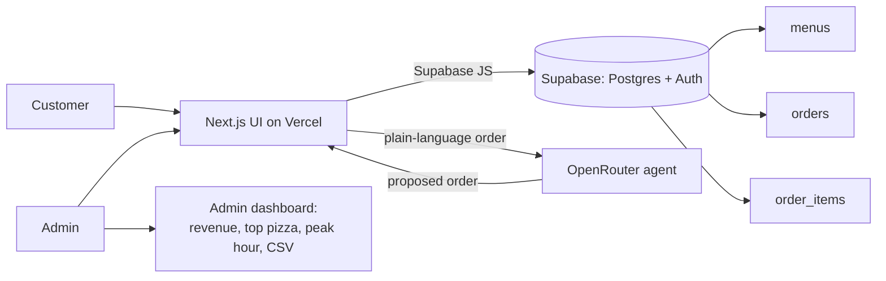

<div align="center">

# SliceMatic

<a href="docs/AI_FEATURE.md">
  
</a>


</div>

## The problem

SliceMatic is a delivery-first pizza outlet in New Ashok Nagar, Delhi. Every order today comes
in over the phone, and that is where the trouble starts.

- Orders get written down by hand, so they are slow and easy to garble. A busy evening means
  missed calls and the wrong topping showing up at someone's door.
- The money gets worked out in someone's head: the item prices, the bulk discount, then 18% GST
  on top. Those slips turn into refunds and arguments with the rider at the gate.
- Nothing survives past the paper slip. There is no record of what sold, when, or to whom, so
  the owner plans the next week on memory instead of numbers.
- At roughly 47 orders a day, that manual back-and-forth eats 60 to 90 staff-minutes daily that
  could have gone into making pizza.

None of this is a software problem on its own. It becomes one the moment the owner wants bills
that are always right, service that does not depend on who picked up the phone, and data worth
looking at.

## What we built

A guided ordering flow that walks a customer from the first prompt to a paid, logged order in
under two minutes. Every field is validated before it is used, every rupee is computed in code
rather than guessed, and every finished order is written to storage the business can query later.

The rules that actually matter (input validation, the 10% discount at five pizzas or more, and
18% GST charged on the post-discount total) live in one small, dependency-free module. They do
not change between the prototype and the production app. Only the shell around them does: a
Gradio MVP first, then a Next.js front end on Vercel backed by Supabase.

> We keep one number honest above all others. The reference order, a Cheese Burst with BBQ
> Chicken and Extra Cheese at quantity 5, comes to **Rs.3,594.87**, and the test suite asserts
> that figure to the paisa. If a refactor ever moves it, the tests fail.

## Architecture



The agent only ever turns messy text into a *proposed* order. The shared rules validate it and
do the arithmetic, so the language layer and the money layer never blur together.

## How ordering works

The flow is state-driven, one step at a time, never one giant form:

```
intake  ->  quantity  ->  base  ->  pizza  ->  topping  ->  bill  ->  payment  ->  done
```

Menus load from `menu/*.txt` at startup (and from the database in Stage 3), so nothing about the
menu is hard-coded. That matters here: the grader swaps the menu files before testing, and the
loader is built to survive it (it strips whitespace and BOMs, skips a malformed line instead of
dying on it, and fails cleanly only when a whole file is missing or empty). The bill renders as a
real table with aligned columns, not a wall of text.

## Run the MVP

```bash
cd stage2-gradio
pip install -r requirements.txt
python app.py
```

Run the checks (plain asserts, no pytest needed):

```bash
cd stage2-gradio
python tests/test_core.py
```

That covers the reference bill, the discount boundary, and the eight edge cases the grader is
known to throw: a name that is only spaces, a 10-digit phone starting with 1, quantity 0 and 11,
quantity typed as "three" or "2.5", a price entered where an item number belongs, empty input at
every prompt, and a menu file with a missing price field. None of them should raise.

## The AI layer

Stage 3 puts a conversational agent in front of the flow, running through OpenRouter. The
customer types naturally and the model collects name, phone, quantity, and the three menu
choices, asking again for anything missing and offering the closest match when someone says
"something spicy." The model proposes; it does not decide. The same core rules validate the
result and compute the bill, so the AI never does the money.

The piece we want next is voice. The outlet began on the phone, and voice ordering brings that
back, except the call is now automated, validated, and logged. Speech in, the same agent in the
middle, speech back out, and it drops to plain typing wherever the browser cannot do speech. The
system prompt, the model choice, and the bonus plan are written up in
[docs/AI_FEATURE.md](docs/AI_FEATURE.md).

## Where each stage stands

| Stage | Deliverable | Due | State |
|---|---|---|---|
| 1 | PRD and business unit economics | Jun 25 | Written; exporting to PDF |
| 2 | Gradio MVP (`.py` + 3 menus + sample log) | Jun 27 | Built and runnable, tests green |
| 3 | Next.js on Vercel + Supabase + OpenRouter | Jul 2 | In progress |

## Stack

Python and Gradio for the MVP. Next.js on Vercel, Supabase for Postgres and Auth, and OpenRouter
for the language model in the production build. scikit-learn comes in if we add demand
forecasting on the admin side.

## Repository layout

```
docs/              PRD, business economics, technical spec, AI feature, reference brief
stage2-gradio/     The MVP: core.py (rules), app.py (UI), menu/, tests/, sample orders_log.txt
stage3-fullstack/  Production build (Next.js + Supabase + OpenRouter)
```

Worth reading in order: [the PRD](docs/PRD.md), [the economics](docs/BUSINESS_ECONOMICS.md),
[the spec](docs/SPEC.md), and [the AI feature](docs/AI_FEATURE.md).

## Team

Built by Om ([@omiiii21](https://github.com/omiiii21)), Febin, Alok, Guru, and Rahul for the
FDE Academy programme.
