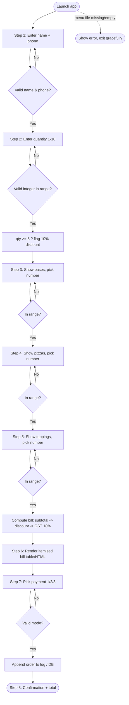

# SliceMatic: Product Requirements Document (PRD)

**Team:** Om, Febin, Alok, Guru, Rahul · **Repo:** `Slicematic_Agentic_Flow` · **Date:** June 2026

---

## 1. Product Vision

SliceMatic's ordering system is a digital, single-outlet pizza-ordering platform for a delivery-first QSR in New Ashok Nagar, Delhi. It replaces error-prone, slow telephone order-taking with a guided, validated, self-service flow that walks a customer from intake to a GST-correct bill and a confirmed payment in under two minutes — and writes every order to a durable log so the owner can run the business on data instead of memory. It serves urban 18–35 customers within a 4 km radius and the outlet staff who currently transcribe
orders by hand. The problem it replaces: missed/garbled phone orders, manual price and
discount maths, no record of what sold, and zero analytics.

---

## 2. Functional Requirements

Each requirement is written precisely enough to build from. IDs are referenced by the
technical spec (`SPEC.md`) and the test suite.

### FR-1 Customer onboarding
- FR-1.1 Collect **name**: letters and spaces only, 2–40 characters.
- FR-1.2 Collect **phone**: exactly 10 digits, first digit ∈ {6,7,8,9} (Indian mobile).
- FR-1.3 On invalid input, show a **specific** error and re-prompt on the same step; never advance, never crash.
- FR-1.4 Record a session timestamp when intake begins.

### FR-2 Quantity selection
- FR-2.1 Accept integers **1–10** only. Reject 0, negatives, floats, and words.
- FR-2.2 Auto-apply a **10% discount when qty ≥ 5**; the discount line must appear on the bill.
- FR-2.3 Reject qty > 10 with an explanation (outlet capacity is 10 pizzas/order).

### FR-3 Menu browsing (loaded from files / DB)
- FR-3.1 Load `Types_of_Base.txt`, `Types_of_Pizza.txt`, `Types_of_Toppings.txt` at startup. **No hardcoded menu.**
- FR-3.2 Display each menu as a numbered list with name + INR price.
- FR-3.3 Accept selection **by item number only**; reject out-of-range numbers, letters, and empty input.
- FR-3.4 Customer composes one pizza = one **base** + one **pizza** + one **topping**.

### FR-4 Pricing engine
- FR-4.1 Per-unit price = base + pizza + topping.
- FR-4.2 Subtotal = per-unit × qty.
- FR-4.3 Discount = 10% of subtotal when qty ≥ 5, else 0.
- FR-4.4 GST = **18% of the post-discount subtotal** (discount first, then GST).
- FR-4.5 Final payable = post-discount subtotal + GST. All money rounded to 2 decimals.

### FR-5 Order summary & bill
- FR-5.1 Itemised bill: each component, unit price, qty, line amount.
- FR-5.2 Show subtotal, discount (if any), post-discount, GST, and total payable.
- FR-5.3 Rendered in a structured component (table / HTML), **not** a plain text box, with currency symbol and aligned columns.

### FR-6 Payment flow
- FR-6.1 Exactly three modes: **1 Cash · 2 Card · 3 UPI**.
- FR-6.2 Reject any other selection with a retry prompt.
- FR-6.3 Show a mode-specific confirmation message.

### FR-7 Order persistence
- FR-7.1 Append every completed order to `orders_log.txt` (Stage 2) / Supabase tables (Stage 3).
- FR-7.2 Each record includes: timestamp, name, phone, item selections, unit prices, qty, subtotal, discount, GST, total, payment mode.
- FR-7.3 Format: one order block, pipe-separated `key=value` fields, blank line between orders (parseable + human-readable).

---

## 3. Non-Functional Requirements

| Area | Rule |
|---|---|
| **Validation** | Every input validated before use; see the validation table in `SPEC.md` (one regex/rule per field). |
| **Error messages** | Specific and actionable ("Indian mobile numbers must start with 6, 7, 8 or 9"), never a stack trace. |
| **Edge-case safety** | The 8 grader edge cases must be handled with **zero unhandled exceptions**. Verified by `tests/test_core.py`. |
| **Menu-swap safety** | Parser must survive the grader swapping the files: strip whitespace/BOM, skip rows with missing fields or non-numeric price, error cleanly if a file is missing or has no valid rows. |
| **Orders log format** | UTF-8, append-only, one block/order, blank-line separated, `key=value` pipe-joined fields. |
| **Graceful failure** | Missing/empty menu file → visible message and stop, not a crash. |
| **Determinism** | Same inputs → same bill, to the paisa, matching the reference sample (Rs.3,594.87). |
| **Statelessness of logic** | Pricing/validation live in a pure module (`core.py`) reused unchanged by the Stage 3 backend. |

---

## 4. User Flow Diagram

---

## 5. Drawbacks Analysis (honest limitations)

This system, **exactly as specified**, has real limits:

1. **One pizza composition per order.** The spec models a single base+pizza+topping unit
   multiplied by quantity. A real order ("2 Margherita + 1 BBQ") needs a multi-line cart;
   ours applies the same composition to all N pizzas.
2. **Flat-file persistence does not scale.** `orders_log.txt` works for a demo but at
   **1,000 orders** it has no indexing, no concurrent-write safety (two simultaneous orders
   can interleave/corrupt a line), no querying, and no backup. This is the core reason Stage 3
   moves to Postgres/Supabase.
3. **No inventory or availability.** The menu loads from a file; nothing tracks stock-outs,
   so a customer can order a sold-out item.
4. **No real payment.** "Payment" is a selected mode + confirmation string — no gateway, no
   settlement, no idempotency, no refunds.
5. **No authentication / abuse protection.** Anyone can place orders; no OTP on the phone
   number, no rate limiting, no fraud checks.
6. **Discount logic is shallow.** A blanket 10% at qty ≥ 5 with no minimum order value or
   per-customer cap is exploitable and may erode margin (see `BUSINESS_ECONOMICS.md`, Q4).
7. **GST is single-rate, delivery-only.** Hardcoded 18% ignores the 5% dine-in case and any
   ITC accounting — fine for delivery, wrong if the model expands.
8. **Single-session, no resumption.** If the browser closes mid-flow, the order is lost.
9. **No observability.** No logging/metrics/alerting beyond the orders file; failures are invisible to the owner.

**What's missing for real production:** a database with constraints + backups, auth + OTP,
a payment gateway with webhooks, inventory, structured app logging/monitoring, automated
tests in CI, and a deployment pipeline. Stages 2→3 deliberately close the biggest of these.

**Future scope (beyond Stage 3).** The headline next step is a **voice ordering agent**: the
customer *speaks* their order and hears the assistant reply, layering browser speech-to-text
and text-to-speech over the conversational ordering agent. This brings SliceMatic full circle —
the outlet began with customers phoning in their orders; voice restores that natural "just
talk" experience while keeping every order automated, validated, priced correctly, and logged.
It reuses the same `core.py` rules (the model never does the maths) and degrades gracefully to
typing where speech isn't available. Further out: multi-pizza carts, live inventory/availability,
a real payment gateway, OTP authentication, and multilingual (Hindi/Hinglish) ordering. See
`AI_FEATURE.md` (Option D) for the voice design.

---

## 6. Cost vs Value Analysis

### Build effort (estimated engineering hours, team of 3–4)

| Work item | Hours |
|---|---|
| Stage 1 — PRD + business model | 8–10 |
| Stage 2 — Gradio MVP (logic, validation, bill, logging, tests) | 18–24 |
| Stage 3 — Next.js on Vercel (UI + full flow) | 22–30 |
| Stage 3 — Supabase schema, auth, admin dashboard, CSV export | 16–22 |
| Stage 3 — AI feature (OpenRouter agent) + README/system prompt | 10–14 |
| Demo prep, Loom, hardening | 8–10 |
| **Total** | **≈ 82–110 hrs** |

### Measurable value to SliceMatic

- **Operational efficiency:** removes ~1–2 min of manual transcription + maths per call.
  At 47 orders/day that is ~60–90 staff-minutes/day reclaimed, fewer wrong orders, and
  faster turnaround — counter staff can be redeployed.
- **Revenue / margin:** validated pricing + correct GST eliminates billing errors; the bulk
  discount nudges basket size; data enables menu engineering toward high-margin combos.
- **Data asset:** every order captured (item mix, AOV, time-of-day, payment split, repeat
  customers) — the foundation for the forecasting/recommendation AI features and for the
  three BI metrics in `BUSINESS_ECONOMICS.md` Q6.
- **Customer experience:** consistent, fast, self-service ordering with a transparent bill;
  the AI layer adds personalised suggestions / natural-language ordering.

**Verdict:** at a contribution margin of ~Rs.644/order, the build pays for itself quickly if
it lifts conversion or basket size even marginally and prevents order errors — the durable
data asset is worth more than the hours spent.
