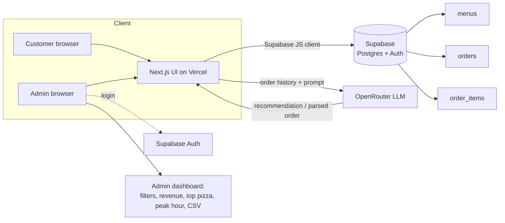

# SliceMatic — Technical Specification

**FDE Programme · Batch 2487 · PizzaFlow** — the build contract for Stages 1→3.
Read this with `PRD.md` (what) and this doc (how). Functional-requirement IDs (FR-x) are defined in the PRD.

---

## 1. Architecture (target, Stage 3)



**Stage 2 (MVP)** collapses this to one process: Gradio UI + `core.py` logic + `orders_log.txt`.
**Stage 3** swaps the UI for Next.js/Vercel and the flat file for Supabase, **reusing `core.py`'s
rules unchanged** (ported to TS or called via a thin Python API). The logic is the constant; the
shell changes.

---

## 2. Repository layout

```
Slicematic_Agentic_Flow/
├── README.md                  # overview, architecture, how to run, AI claim
├── docs/
│   ├── PRD.md                 # Stage 1A — requirements + user flow
│   ├── BUSINESS_ECONOMICS.md  # Stage 1B — financial model + challenge Qs
│   ├── SPEC.md                # this file
│   └── AI_FEATURE.md          # AI feature design + system prompt (claim)
├── stage2-gradio/
│   ├── core.py                # pure logic (validation, pricing, GST, log)
│   ├── app.py                 # Gradio Blocks UI (state-driven flow)
│   ├── requirements.txt
│   ├── orders_log.txt         # sample log (parseable format)
│   ├── menu/                  # Types_of_{Base,Pizza,Toppings}.txt
│   └── tests/test_core.py     # reference bill + all 8 edge cases
└── stage3-fullstack/          # Next.js + Supabase + OpenRouter (roadmap README)
```

---

## 3. Validation rules (single source of truth)

Implemented in `core.py`; every function returns `(ok, message, value)`.

| Field | Rule | Rejects (edge cases) |
|---|---|---|
| Name | strip; letters+spaces only; 2–40 chars; ≥2 letters | only spaces (1), empty (6), digits |
| Phone | strip; exactly 10 digits; first digit 6–9 | starts with 1 (2), empty (6), non-digit, wrong length |
| Quantity | integer 1–10 | 0/negatives & 11 (3), "three"/"2.5" (7), empty (6) |
| Selection | integer 1..menu_len | 0 or > length (4), a price like "229" (5), letters, empty (6) |
| Payment | integer ∈ {1,2,3} | anything else, empty (6) |
| Menu file | strip/BOM; skip rows missing a field or non-numeric price; error if file missing or 0 valid rows | missing price field (8), missing file |

> The grader swaps the menu files. `load_menu` uses `utf-8-sig` (BOM-safe), trims each field,
> skips malformed rows individually, and raises `MenuLoadError` only when a file is absent or
> yields zero usable items — so a few bad lines never cost the rest of the menu.

---

## 4. Pricing algorithm (FR-4) — discount THEN GST

```
unit_price    = base.price + pizza.price + topping.price
subtotal      = unit_price * qty
discount_rate = 0.10 if qty >= 5 else 0.0
discount      = round(subtotal * discount_rate, 2)
post_discount = subtotal - discount
gst           = round(post_discount * 0.18, 2)
total         = post_discount + gst
```

All money `round(_, 2)`. Order of operations is load-bearing: **GST is computed on the
post-discount amount**, matching the reference bill (Rs.3,594.87). Constants
(`BULK_DISCOUNT_MIN_QTY`, `GST_RATE`, …) live at the top of `core.py` — the live-demo task
"change the discount threshold from 5 to 3" is a **one-line edit** there.

---

## 5. Order log format (Stage 2, FR-7)

One block per order, `key=value` fields joined by ` | `, blank line between orders:

```
timestamp=YYYY-MM-DD HH:MM:SS | name=… | phone=… | base=ID:Name:Price | pizza=ID:Name:Price | topping=ID:Name:Price | unit_price=… | qty=… | subtotal=… | discount=… | gst=… | total=… | payment=Cash|Card|UPI
```

Parse with `dict(kv.split("=",1) for kv in block.split(" | "))`. Human-readable **and**
machine-parseable; the Stage 3 migration script reads this straight into the `orders`/`order_items`
tables.

---

## 6. Stage 3 — Supabase schema (3+ tables, normalised)

```sql
-- Menu items (replaces the .txt files; one row per sellable item)
create table menus (
  id          text primary key,              -- 'B3', 'P7', 'T2'
  category    text not null check (category in ('base','pizza','topping')),
  name        text not null,
  price       numeric(10,2) not null check (price >= 0),
  is_active   boolean not null default true
);

-- One row per placed order (header + computed totals)
create table orders (
  id            uuid primary key default gen_random_uuid(),
  created_at    timestamptz not null default now(),
  customer_name text not null,
  phone         text not null check (phone ~ '^[6-9][0-9]{9}$'),
  quantity      int  not null check (quantity between 1 and 10),
  subtotal      numeric(10,2) not null,
  discount      numeric(10,2) not null default 0,
  gst           numeric(10,2) not null,
  total         numeric(10,2) not null,
  payment_mode  text not null check (payment_mode in ('Cash','Card','UPI'))
);

-- Line items: the base/pizza/topping that composed the order (price snapshot)
create table order_items (
  id          uuid primary key default gen_random_uuid(),
  order_id    uuid not null references orders(id) on delete cascade,
  menu_id     text not null references menus(id),
  component   text not null check (component in ('base','pizza','topping')),
  unit_price  numeric(10,2) not null            -- snapshot at order time
);
create index on orders (created_at);
create index on order_items (order_id);
```

**Design justification (be ready to defend at the demo):**
- `menus` is its own table so the admin can change prices/availability without a redeploy, and
  `order_items.unit_price` snapshots the price **at order time** so historical bills never change
  if the menu later changes.
- `orders` holds computed totals (denormalised on purpose) so the dashboard's revenue/AOV queries
  don't recompute from line items every read.
- `order_items` (3 rows/order: base, pizza, topping) keeps the schema normalised and makes
  item-level analytics (attach rate, top pizza) a simple `group by`.
- `check` constraints push the **same validation rules** into the database as a backstop, and
  `on delete cascade` keeps line items consistent.

**Admin dashboard queries:** total revenue = `sum(total)`; top pizza =
`order_items where component='pizza' group by menu_id order by count desc limit 1`; busiest hour =
`group by date_trunc('hour', created_at)`; CSV export = client-side serialise of the filtered
`orders` join. Auth via Supabase Auth (email/password), RLS so only authenticated admins read all
orders.

---

## 7. AI feature integration (Stage 3)

Powered by **OpenRouter**; system prompt documented in `AI_FEATURE.md` and the README. **Money
maths is never delegated to the LLM** — the model only extracts/recommends; `core.py` (or its TS
port) computes every rupee. See `AI_FEATURE.md` for the chosen feature, prompt, model, and
fallback behaviour.

---

## 8. Deployment & ops

| Concern | Approach |
|---|---|
| Frontend | Next.js on **Vercel**, public URL, responsive, full ordering flow |
| Backend/DB | **Supabase** (Postgres + Auth); read-only project access shared with grader |
| Secrets | OpenRouter + Supabase keys in env vars (Vercel project settings); never committed (`.gitignore`) |
| Version control | GitHub, **meaningful commits from every team member across all 3 weeks** (a single final-day upload scores zero on VC) |
| Demo readiness | Loom 3–5 min walkthrough; live 10-min demo; each member can explain a random function, justify a table, and modify a live feature |

---

## 9. Testing

`stage2-gradio/tests/test_core.py` (runnable as `python tests/test_core.py`, no pytest needed)
asserts: the exact reference bill, the discount threshold boundary, all 8 grader edge cases,
defensive/menu-swap parsing, and order-record round-tripping. Run it before every submission.
