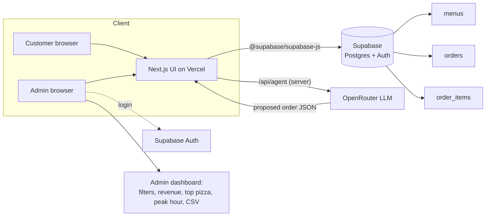

# SliceMatic — Stage 3 (Full-Stack)

Production rebuild of the Stage 2 Gradio MVP: **Next.js (App Router) + Supabase (Postgres + Auth) +
OpenRouter**. The ordering rules (validation, 10% bulk discount, 18% GST on the post-discount total)
are ported **faithfully** from `../stage2-gradio/core.py` into `lib/core.ts` — the logic is the
constant; only the shell changes.

> Reference order — Cheese Burst (229) + BBQ Chicken (379) + Extra Cheese (69), qty 5 — totals
> **Rs.3594.87**. Verified by `npm run test:core`.

---

## Architecture



- **Frontend** — Next.js App Router on Vercel. Pages: `/order` (form flow), `/agent` (AI chat),
  `/admin` (auth-gated dashboard).
- **Backend / DB** — Supabase Postgres with three normalised tables (`menus`, `orders`,
  `order_items`) and RLS; Supabase Auth (email/password) for the admin.
- **AI** — OpenRouter, called **only** from the server route `/api/agent`; the key never reaches the
  browser. The model proposes a structured order; `lib/core.ts` validates it and computes every
  rupee (the LLM does no arithmetic).

### Why these tables (defend at the demo)
- `menus` is a table so admins can change prices/availability without a redeploy; `order_items`
  snapshots `unit_price` at order time so historical bills never change.
- `orders` stores computed totals (denormalised on purpose) so dashboard revenue/AOV reads don't
  recompute from line items.
- `order_items` (3 rows/order) keeps item-level analytics — attach rate, top pizza — a simple
  `group by`. `check` constraints push the same validation into the DB; `on delete cascade` keeps
  line items consistent.

---

## Project layout (key files)

```
stage3-fullstack/
├── app/
│   ├── layout.tsx          # root layout + nav, imports globals.css
│   ├── globals.css         # base styles, red #ef4444 accent
│   └── page.tsx            # home: intro + links to /order, /agent, /admin
├── lib/
│   ├── core.ts             # FAITHFUL TS port of core.py (rules + pricing)
│   ├── core.test.ts        # asserts reference bill, discount boundary, validators
│   ├── types.ts            # shared types matching the schema
│   ├── supabase.ts         # lazy client factories (never throw at import)
│   └── menu.ts             # getMenus() with offline seed fallback
├── supabase/
│   ├── schema.sql          # tables, checks, indexes, RLS
│   └── seed.sql            # menu rows (bases B1-B5, pizzas P1-P8, toppings T1-T10)
├── .env.local.example      # the 4 env vars (placeholders)
├── package.json
├── tsconfig.json
└── next.config.mjs
```

---

## Setup

### 1. Install
```bash
cd stage3-fullstack
npm install
```

### 2. Supabase
1. Create a project at https://supabase.com.
2. In the SQL editor, run **`supabase/schema.sql`**, then **`supabase/seed.sql`**.
3. (Admin) Authentication → Users → add an email/password user for the dashboard login.
4. Project Settings → API: copy the **Project URL** and the **anon public** key.

### 3. Environment variables
Copy the example and fill in real values (never commit `.env.local`):
```bash
cp .env.local.example .env.local
```
| Var | Where | Notes |
|---|---|---|
| `NEXT_PUBLIC_SUPABASE_URL` | client + server | Supabase project URL |
| `NEXT_PUBLIC_SUPABASE_ANON_KEY` | client + server | anon public key (RLS guards data) |
| `OPENROUTER_API_KEY` | **server only** | used in `/api/agent`; never sent to the client |
| `OPENROUTER_MODEL` | server | model string, swappable without code changes |

> **Graceful degradation:** with no env vars the app still builds and runs. The menu falls back to a
> hardcoded seed (so `/order` and `/agent` are demoable offline) and data pages show a
> "Configure `.env.local` (see README)" notice instead of crashing.

### 4. Local dev
```bash
npm run dev          # http://localhost:3000
npm run test:core    # asserts the reference bill (Rs.3594.87) + validators
npm run build        # production build (succeeds without secrets)
```

---

## Deploy to Vercel
1. Import the repo into Vercel.
2. **Set Root Directory = `stage3-fullstack`** (this app is a subdirectory of the monorepo).
3. Add the 4 environment variables in Project Settings → Environment Variables.
4. Deploy. Framework preset auto-detects Next.js.

---

## AI feature — Conversational Ordering Agent (Option B)

The customer orders in natural language; the LLM **extracts and confirms** the fields (name, phone,
quantity, base, pizza, topping, payment) and re-prompts for anything missing. The model never does
arithmetic or invents menu items — when all fields are confirmed it returns strict JSON, which the
server validates with `lib/core.ts` before pricing and persisting. Malformed/partial JSON re-enters
the conversation loop; if OpenRouter is unavailable the UI falls back to the `/order` form so
ordering never breaks.

### Model choice
`OPENROUTER_MODEL` defaults to **`openai/gpt-4o-mini`** (alt: `anthropic/claude-3.5-haiku`). Reasoning:
a fast, low-cost, strong instruction-following model is ideal for a per-message ordering loop that
only needs reliable structured extraction — not heavy reasoning. It is set via env var so it can be
swapped without code changes.

### System prompt (copied from `../docs/AI_FEATURE.md`)
```
You are SliceMatic's ordering assistant for a single pizza outlet in New Ashok Nagar, Delhi.
Your ONLY job is to collect a valid order from the customer through natural conversation and
return it as structured data. You do NOT calculate prices, discounts, or taxes — the application
does all maths. You do NOT invent menu items.

You will be given the current MENU as three lists (bases, pizzas, toppings), each item as
{number, name, price}. The customer composes ONE pizza = one base + one pizza + one topping,
ordered in a quantity from 1 to 10.

Fields to collect and confirm, one at a time, in a friendly and concise tone:
  - name: letters and spaces only, 2–40 characters
  - phone: exactly 10 digits, must start with 6, 7, 8 or 9
  - quantity: a whole number from 1 to 10
  - base, pizza, topping: must each be an item from the provided menu (match by name/number)
  - payment_mode: one of Cash, Card, UPI

Rules:
  - Ask for missing fields; never assume a value the customer did not give.
  - If the customer is vague ("something spicy", "the cheesy one"), suggest the closest 1–2
    menu items by name and ask them to confirm. Never pick silently.
  - If an input is invalid (e.g. a phone starting with 1, quantity 0 or 11), explain briefly and
    re-ask. Do not advance.
  - Only choose items that appear in the provided menu. If asked for something not on the menu,
    say it isn't available and offer the closest option.
  - Do NOT state prices, totals, discounts, or GST — say the app will show the final bill.

When ALL fields are collected and confirmed, respond with ONLY this JSON (no prose, no markdown):
{"name": "...", "phone": "...", "quantity": <int>, "base_id": "<menu id>",
 "pizza_id": "<menu id>", "topping_id": "<menu id>", "payment_mode": "Cash|Card|UPI"}
Until then, reply conversationally with your next question.
```

---

## Pricing rules (single source of truth — `lib/core.ts`)
```
unit          = base + pizza + topping
subtotal      = unit * qty
discountRate  = 0.10 if qty >= 5 else 0
discount      = round(subtotal * discountRate, 2)
postDiscount  = subtotal - discount
gst           = round(postDiscount * 0.18, 2)
total         = postDiscount + gst        # all money round(_, 2)
```
The discount threshold lives in one constant (`BULK_DISCOUNT_MIN_QTY`) — the live-demo task "change
5 to 3" is a one-line edit.
